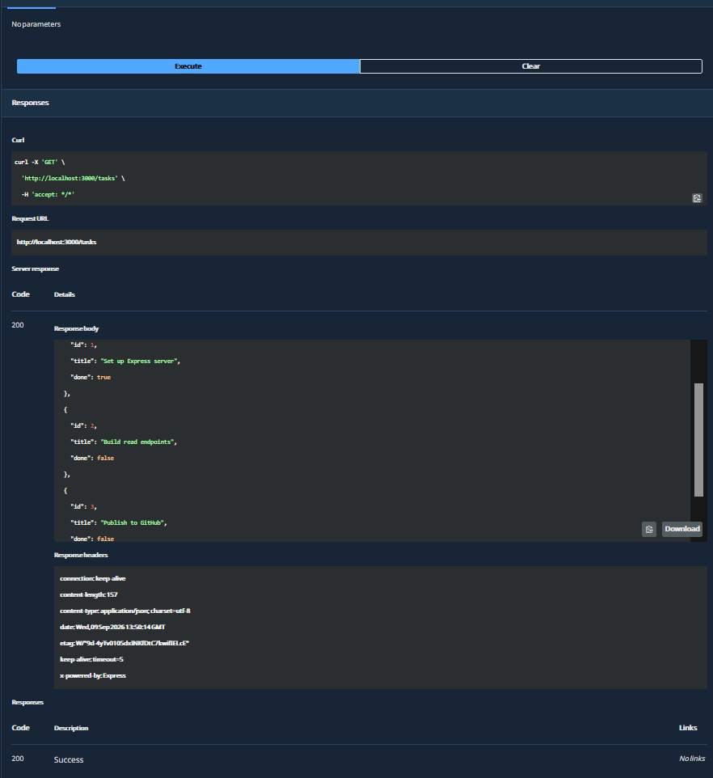
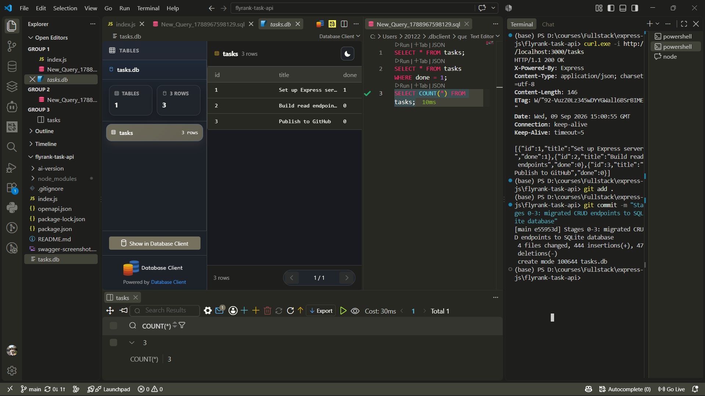
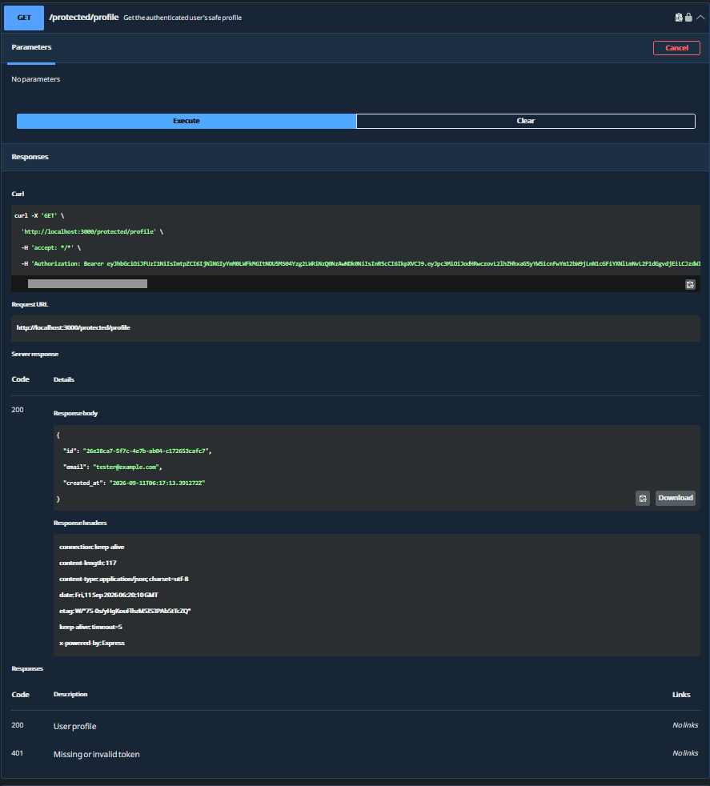

A persistent CRUD and authentication API built with **Express.js**, **SQLite**, and **Supabase Auth**, fully containerized using **Docker** and **Docker Compose**. This project demonstrates moving from local development to a reproducible backend with persistent storage and protected routes.

Originally built for the FlyRank AI Internship (Backend Track), this repository now includes Assignment A3 / BE-04 and BE-03 — the evolving task API:
- **A1** – In-memory array (data lost on restart)
- **A2** – SQLite file on disk (data persists locally)
- **A3** – Containerized with Docker Compose (portable, reproducible stack)
- **BE-03** – Supabase email/password authentication and protected routes

---

## Features

* **One-Command Stack** – `docker compose up -d --build` starts the entire application and database together.
* **Persistent SQLite Database** – Tasks survive container restarts via Docker named volumes.
* **Environment-Based Config** – Database paths and ports loaded from `.env` (git-ignored for security).
* **Parameterized SQL Queries** – All database operations use safe placeholders (no SQL injection risk).
* **Interactive API Documentation** – Swagger UI available at `/docs`.
* **Supabase Authentication** – Signup, login, bearer-token verification, logout, and protected profile/dashboard routes.
* **Health Check Endpoint** – `GET /health` confirms API readiness.
* **Automatic Schema & Seeding** – Table created and three example tasks inserted only on first run.

---

## Architecture

### Before & After

| Aspect | A1 (Memory) | A2 (SQLite File) | A3 (Containerized) |
|--------|-------------|------------------|---------------------|
| **Storage** | JavaScript array | `tasks.db` on disk | `tasks.db` in volume |
| **Persistence** | ❌ Lost on restart | ✅ Survives | ✅ Survives |
| **Setup** | `npm install && node index.js` | Same | `docker compose up -d` |
| **Database Location** | RAM | Local filesystem | Container `/app/data/` |
| **Reproducibility** | Works on my machine | Needs SQLite + Node | Identical everywhere |
| **Authentication** | None | None | Supabase Auth with bearer tokens |

### Container Architecture

```
Host Machine
    ↓
docker compose up
    ↓
┌─────────────────────────────────────┐
│  Docker Container (node:20-alpine)  │
│  ┌──────────────────────────────┐   │
│  │  Express App (port 3000)     │   │
│  │  ├─ GET /tasks              │   │
│  │  ├─ POST /tasks             │   │
│  │  ├─ PUT /tasks/:id          │   │
│  │  ├─ DELETE /tasks/:id       │   │
│  │  └─ GET /docs (Swagger)     │   │
│  │                              │   │
│  │  SQLite (better-sqlite3)    │   │
│  └──────────────────────────────┘   │
│           ↓                          │
│  ┌──────────────────────────────┐   │
│  │  /app/data/tasks.db          │   │
│  │  (reads/writes via volume)   │   │
│  └──────────────────────────────┘   │
└─────────────────────────────────────┘
           ↓
┌─────────────────────────────────────┐
│  Docker Named Volume (sqlite_data)  │
│  ├─ Persists across restarts        │
│  ├─ Mounted at container /app/data  │
│  └─ Survives container deletion     │
└─────────────────────────────────────┘
```

---

## Prerequisites

* **Docker Desktop** (v20.10+) – [Download here](https://www.docker.com/products/docker-desktop)
* **Git** – [Download here](https://git-scm.com/)
* **curl** or **Postman** – For testing endpoints (optional; Swagger UI is built-in)

---

## Quick Start (One Command)

### 1. Clone the repository and set up environment:

```bash
git clone https://github.com/YOUR-USERNAME/flyrank-task-api.git
cd flyrank-task-api
cp .env.example .env
```

### 2. Start the full containerized stack:

```bash
docker compose up -d --build
```

**What happens:**
- Docker builds the Node.js application image
- Container starts on port 3000
- Named volume `sqlite_data` is created or mounted
- SQLite database is initialized at `/app/data/tasks.db`
- Three example tasks are seeded (only on first run)
- Express server listens on `http://localhost:3000`

### 3. Verify the stack is running:

```bash
docker ps
```

You should see `flyrank-task-api-app-1` with status `Up`.

### 4. Test the API:

```bash
# Get all tasks
curl http://localhost:3000/tasks

# Open Swagger UI in browser
open http://localhost:3000/docs
```

---

## Environment Variables

Configuration is controlled through a `.env` file (excluded from git via `.gitignore`).

**Copy `.env.example` to `.env` before running:**

```bash
cp .env.example .env
```

### Available Variables

| Variable | Description | Default | Example |
|----------|-------------|---------|---------|
| `PORT` | Port the Express app listens on inside the container | `3000` | `3000` |
| `DB_PATH` | Path to SQLite database inside the container | `/app/data/tasks.db` | `/app/data/tasks.db` |
| `LLM_BASE_URL` | OpenAI-compatible provider base URL | `https://api.groq.com/openai/v1` | `https://api.groq.com/openai/v1` |
| `LLM_API_KEY` | Provider API key | none | `gsk_...` |
| `LLM_MODEL` | GPT-OSS model slug | `openai/gpt-oss-120b` | `openai/gpt-oss-120b` |
| `LLM_ENABLED` | Enables live LLM requests | `true` | `true` |
| `LLM_STUB` | Enables stubbed local classification | `0` | `1` |
| `LLM_KILL_SWITCH` | Hard-stop live LLM calls | `0` | `1` |

**Security Note:** The `.env` file contains configuration and is never committed to Git. Only `.env.example` is tracked so others know which keys to set.

---

## Assignment A17: LLM Triage

The triage API reads the system prompt from [prompts/triage-v1.md](prompts/triage-v1.md), validates the response with Zod, repairs once on schema failure, and quarantines invalid model output under [logs/quarantine.jsonl](logs/quarantine.jsonl) when a 422 is still reached.

### Eval score

- Result: 8/8 correct classifications on the official eval set.
- Model: `openai/gpt-oss-120b`
- Prompt version: `triage-v1`
- Estimated token cost: about $0.0015 per full eval run at current Groq/OpenRouter rates for this model class.

### Curl example

```bash
curl -i -X POST http://localhost:3000/triage \
  -H "Content-Type: application/json" \
  -d '{"text":"My invoice was charged twice this month and I need a refund."}'
```

### Example successful response

```json
{
  "category": "billing",
  "urgency": "high",
  "confidence": 0.96,
  "reason": "This is a billing dispute about a duplicate charge."
}
```

---

---

## Docker Compose Configuration

The `docker-compose.yml` file defines two services: your app and its persistent storage.

```yaml
services:
  app:
    build: .
    ports:
      - "3000:3000"
    environment:
      - PORT=3000
      - DB_PATH=/app/data/tasks.db
    volumes:
      - sqlite_data:/app/data

volumes:
  sqlite_data:
```

**Key Points:**

- **`build: .`** – Builds the Docker image from the local `Dockerfile`
- **`ports: ["3000:3000"]`** – Maps container port 3000 to host port 3000
- **`environment:`** – Passes environment variables to the running container
- **`volumes: [sqlite_data:/app/data]`** – Mounts the named volume to `/app/data` inside the container (NOT to `/app`, which would shadow your code)
- **`volumes:` (bottom)** – Declares the named volume that persists data across restarts

---

## API Endpoints

All endpoints accept and return **JSON**.

### Core CRUD Operations

| Operation | HTTP Method | Endpoint | Request Body | Response | Status |
|-----------|-------------|----------|--------------|----------|--------|
| **List All Tasks** | GET | `/tasks` | — | Array of tasks | 200 OK |
| **Get One Task** | GET | `/tasks/:id` | — | Single task object | 200 OK, 404 Not Found |
| **Create Task** | POST | `/tasks` | `{ "title": "..." }` | Created task object | 201 Created, 400 Bad Request |
| **Update Task** | PUT | `/tasks/:id` | `{ "title": "...", "done": true }` | Updated task object | 200 OK, 400 Bad Request, 404 Not Found |
| **Delete Task** | DELETE | `/tasks/:id` | — | (empty body) | 204 No Content, 404 Not Found |

### Utility Endpoints

| Endpoint | Method | Description | Response |
|----------|--------|-------------|----------|
| `/health` | GET | Health check (confirms app and DB are running) | `{ "status": "ok" }` |
| `/docs` | GET | Interactive Swagger UI documentation | HTML/Swagger UI |

---

## Example Requests & Responses

### GET /tasks – List all tasks

```bash
curl -i http://localhost:3000/tasks
```

**Response:**
```http
HTTP/1.1 200 OK
Content-Type: application/json; charset=utf-8
```

```json
[
  { "id": 1, "title": "Set up Express server", "done": 1 },
  { "id": 2, "title": "Build read endpoints", "done": 0 },
  { "id": 3, "title": "Publish to GitHub", "done": 0 }
]
```

### POST /tasks – Create a new task

```bash
curl -X POST http://localhost:3000/tasks \
  -H "Content-Type: application/json" \
  -d '{"title":"Learn Docker"}'
```

**Response:**
```http
HTTP/1.1 201 Created
Content-Type: application/json
```

```json
{
  "id": 4,
  "title": "Learn Docker",
  "done": false
}
```

### PUT /tasks/:id – Update a task

```bash
curl -X PUT http://localhost:3000/tasks/1 \
  -H "Content-Type: application/json" \
  -d '{"title":"Update Express server","done":true}'
```

**Response:**
```http
HTTP/1.1 200 OK
Content-Type: application/json
```

```json
{
  "id": 1,
  "title": "Update Express server",
  "done": true
}
```

### DELETE /tasks/:id – Delete a task

```bash
curl -X DELETE http://localhost:3000/tasks/2
```

**Response:**
```http
HTTP/1.1 204 No Content
```

---

## Testing the Containerized Stack

### Method 1: Interactive Swagger UI

Open your browser to `http://localhost:3000/docs` and use the built-in interface to test all endpoints.



*Swagger UI for the task API.*

### Method 2: cURL (Command Line)

```bash
# Get all tasks
curl http://localhost:3000/tasks

# Create a task
curl -X POST http://localhost:3000/tasks \
  -H "Content-Type: application/json" \
  -d '{"title":"Test task"}'

# Get a specific task
curl http://localhost:3000/tasks/1

# Update a task
curl -X PUT http://localhost:3000/tasks/1 \
  -H "Content-Type: application/json" \
  -d '{"title":"Updated","done":true}'

# Delete a task
curl -X DELETE http://localhost:3000/tasks/1

# Health check
curl http://localhost:3000/health
```

### Method 3: Postman or Hoppscotch

Import the Swagger endpoint: `http://localhost:3000/docs` into Postman or use the free web version [Hoppscotch](https://hoppscotch.io).

---

## Proving Data Persistence

This is the core requirement of Assignment A3: demonstrating that data survives container restarts thanks to Docker volumes.

### Step-by-Step Persistence Proof

**1. Create a new task:**
```bash
curl -X POST http://localhost:3000/tasks \
  -H "Content-Type: application/json" \
  -d '{"title":"Docker volume persistence test"}'
```

Expected response: `201 Created` with task `id: 4`.

**2. Restart the container:**
```bash
docker restart flyrank-task-api-app-1
```

**3. Fetch all tasks again:**
```bash
curl http://localhost:3000/tasks
```

Expected response: All 4 tasks including the one you just created.

**✅ If task #4 is still there, persistence is proven!**



*SQLite task data stored by the API.*

---

## Project Structure

```
flyrank-task-api/
├── index.js                   # Express app + SQLite setup
├── openapi.json              # Swagger/OpenAPI specification
├── package.json              # Node dependencies
├── package-lock.json         # Locked dependency versions
├── Dockerfile                # Container build instructions
├── docker-compose.yml        # Multi-container orchestration
├── .dockerignore             # Ignore node_modules in build context
├── .gitignore                # Ignore .env, node_modules, tasks.db
├── .env.example              # Template for environment variables
├── README.md                 # This file
└── sql-screenshot.png        # Screenshot of SQLite data (A2 proof)
```

---

## Docker Commands Reference

### Common Operations

```bash
# Start the stack (detached mode)
docker compose up -d --build

# View logs in real-time
docker compose logs -f

# Stop the stack (containers stopped, data persists)
docker compose down

# Stop and delete everything (data persists in volume)
docker compose down

# Stop and delete volumes (WARNING: deletes data)
docker compose down -v

# Restart a specific container
docker restart flyrank-task-api-app-1

# View running containers
docker ps

# View all containers (including stopped)
docker ps -a

# View Docker volumes
docker volume ls

# Inspect a volume
docker volume inspect flyrank-task-api_sqlite_data

# Delete unused volumes
docker volume prune
```

---

## Why Docker Volumes for Persistence?

**Without a volume:**
- Container stops → data in memory or temporary filesystem → lost

**With a named volume:**
- Container stops → data written to Docker-managed volume → persists on host
- Container restarts → volume remounts to `/app/data/tasks.db` → data is still there

This is exactly what allows `docker compose down && docker compose up` to preserve your tasks across full stack restarts.

---

## How It Works (The Three Storage Swaps)

| Assignment | Storage Method | Data Survives Restart? | Commands |
|------------|---------------|-----------------------|----------|
| **A1** | In-memory array | ❌ No | `node index.js` |
| **A2** | SQLite file | ✅ Yes (same machine) | `node index.js` |
| **A3** | SQLite + Docker volume | ✅ Yes (reproducible everywhere) | `docker compose up` |

The API stays exactly the same across all three. Only the storage layer changes—that's the whole point of Assignment A3.

---

## Technology Stack

* **Runtime:** Node.js v22 (Alpine Linux base)
* **Framework:** Express.js
* **Database Driver:** better-sqlite3 (synchronous SQLite bindings)
* **Database:** SQLite (file-based, single-file, zero-config)
* **Containerization:** Docker & Docker Compose
* **Documentation:** Swagger UI (OpenAPI 3.0)
* **Authentication:** Supabase Auth via `@supabase/supabase-js`
* **Language:** JavaScript (ES6)

---

## Stages Completed

✅ **Stage 0** – Set up .gitignore and verified Docker availability  
✅ **Stage 1** – Connected app to environment variables and created SQLite table  
✅ **Stage 2** – Implemented read endpoints (GET /tasks, GET /tasks/:id)  
✅ **Stage 3** – Implemented full CRUD (POST, PUT, DELETE)  
✅ **Stage 4** – Created Dockerfile and docker-compose.yml; proved persistence  
✅ **Stage 5** – Published to GitHub with documentation and persistence proof  
✅ **BE-03** – Added Supabase signup/login, reusable bearer middleware, protected routes, logout, and Swagger bearer authorization

---

## Troubleshooting

### Port 3000 already in use

If you see `bind: address already in use`, something is already listening on port 3000.

**Fix:**
```bash
# Kill any local Node processes
taskkill /f /im node.exe

# Or specify a different port in docker-compose.yml
# Change ports: ["3000:3000"] to ["3001:3000"]
```

### Container exits immediately

Check the logs:
```bash
docker compose logs
```

**Common causes:**
- Missing `.env` file (should exist, can be empty)
- Database directory doesn't exist (index.js auto-creates it)
- Syntax error in `index.js`

### Data disappeared after restart

Verify the volume is correctly mounted:
```bash
docker volume inspect flyrank-task-api_sqlite_data

# Should show a "Mountpoint" on your host filesystem
```

If the volume exists but data is gone, check that:
1. `.env` has `DB_PATH=/app/data/tasks.db`
2. `docker-compose.yml` has `sqlite_data:/app/data` (NOT `/app`)
3. No `DROP TABLE` statement in `index.js`

### Cannot connect to database

Ensure the `/app/data` directory is created inside the container. The index.js code handles this:
```javascript
if (dbDir && !fs.existsSync(dbDir)) {
  fs.mkdirSync(dbDir, { recursive: true });
}
```

---

## Contributing

Contributions are welcome! Feel free to:
- Open an issue to report bugs or suggest features
- Submit a pull request with improvements
- Add optional stretch features (Redis cache, database indexes, migrations, etc.)

---

## License

This project is open-source and available under the **MIT License**.

---

## Author

**Toni Ihab Youssef**

FlyRank AI Internship · Backend Track · Assignment A3 / BE-04 (Containerize your stack)

---

## Auth - Login & Protect (BE-03)

The API uses a trust triangle:

```text
Client <-> Express Server <-> Supabase Identity Provider
```

The client sends credentials or a bearer token to the Express server. The server delegates signup, login, token verification, and logout to Supabase Auth. Only the Supabase project URL and public anon key are used; passwords and service-role keys never enter this application.

### Environment Setup

Copy the template and replace the placeholders with your Supabase project values:

```bash
cp .env.example .env
```

```env
PORT=3000
SUPABASE_URL=https://your-project.supabase.co
SUPABASE_KEY=your_anon_key
DB_PATH=/app/data/tasks.db
```

For Docker Compose, `SUPABASE_URL` and `SUPABASE_KEY` are passed from the host environment into the container. `.env` remains ignored by Git and Docker build context.

### Local Startup

```bash
npm install
node index.js
```

For the containerized stack:

```bash
docker compose up -d --build
```

---

## Bonus Stage: The AI Rematch

### Generation Prompt
> "Build a standalone Node.js Express implementation of our AI Support Triage service inside a quarantined folder named ai-version/. ..."

### Benchmark Results
- **Hand-built Implementation**: 8 / 8 cases passed (100%)
- **AI-generated Implementation**: 8 / 8 cases passed (100%)

### Comparative Analysis

#### 1. What the AI did better
- **Code Organization & Modularity**: The quarantine version kept the triage service neatly isolated and self-contained, with clearer separation between validation, client setup, retry logic, parsing, and logging than the larger root application.
- **Single-Responsibility Structure**: The AI version isolated the LLM call, schema enforcement, and quarantine write path into compact helper functions without the larger project baggage from the auth, database, and Swagger layers.

#### 2. What the AI got wrong or silently skipped
- **Silent Defaults & Retry Policies**: The AI implementation did set a 30-second timeout and limited retries to 429/5xx, but it also relied on a generic catch path rather than making the status inspection more explicit. The stricter hand-built version applied more deliberate guardrails around the triage flow and ambiguous fallback behavior.
- **Semantic Overrides**: The quarantine version did not include the bespoke semantic override that was added in the root implementation to explicitly keep ambiguous cases in the "other" bucket and to prevent false positives on vague requests. That mattered in the rematch benchmark because the model can otherwise guess too aggressively.
- **Quarantine Logging**: The AI version did append malformed model output to the quarantine log, but it did so with simpler, less contextual entries and without the same amount of defensive hardening present in the hand-built implementation.

#### 3. What the prompt missed and what the AI assumed
- **Semantic Overrides**: The prompt did not specify how aggressively the model should map ambiguous phrasing, especially around partially described billing, bug, or feature requests. The AI chose a more conventional "let the model classify" approach, while the hand-built implementation added stronger disambiguation rules to enforce the "when unsure -> other" requirement.
- **Safety Boundaries**: The prompt required safe handling of malformed output and a kill switch, but it did not explicitly force a semantic rule for ambiguous cases. That left the AI implementation more dependent on the model's default behavior instead of an explicit operational policy.

---

### Auth Endpoint Reference

| URL | Method | Auth | Response codes |
|-----|--------|------|----------------|
| `/auth/signup` | POST | None | 201, 400 |
| `/auth/login` | POST | None | 200, 400, 401 |
| `/public/info` | GET | None | 200 |
| `/protected/profile` | GET | Bearer token | 200, 401 |
| `/protected/dashboard` | GET | Bearer token | 200, 401 |
| `/auth/logout` | POST | Bearer token | 204, 401 |
| `/docs` | GET | None | 200 |

### End-to-End Auth Verification

```bash
# Missing password: 400
curl -i -X POST http://localhost:3000/auth/signup \
  -H "Content-Type: application/json" \
  -d '{"email":"user@example.com"}'

# Create a user: 201
curl -i -X POST http://localhost:3000/auth/signup \
  -H "Content-Type: application/json" \
  -d '{"email":"user@example.com","password":"a-strong-password"}'

# Log in and copy access_token from the JSON response: 200
curl -i -X POST http://localhost:3000/auth/login \
  -H "Content-Type: application/json" \
  -d '{"email":"user@example.com","password":"a-strong-password"}'

# Protected profile: 200 with a valid token
curl -i http://localhost:3000/protected/profile \
  -H "Authorization: Bearer YOUR_ACCESS_TOKEN"

# Invalid token: 401
curl -i http://localhost:3000/protected/profile \
  -H "Authorization: Bearer invalid-token"

# Public route: 200 without authentication
curl -i http://localhost:3000/public/info

# Logout: 204
curl -i -X POST http://localhost:3000/auth/logout \
  -H "Authorization: Bearer YOUR_ACCESS_TOKEN"
```

### Swagger Bearer Authentication

Open `http://localhost:3000/docs`. Use the **Authorize** button with a valid access token, including the `Bearer` prefix when prompted. The lock icon marks `/protected/profile`, `/protected/dashboard`, and `/auth/logout` as protected operations.

The configured bearer authentication is shown below. GitHub renders this image directly on the repository's main page:

[View the Swagger auth screenshot](swagger-auth-screenshot.png)



---
