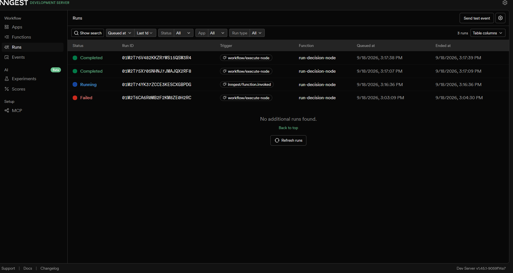
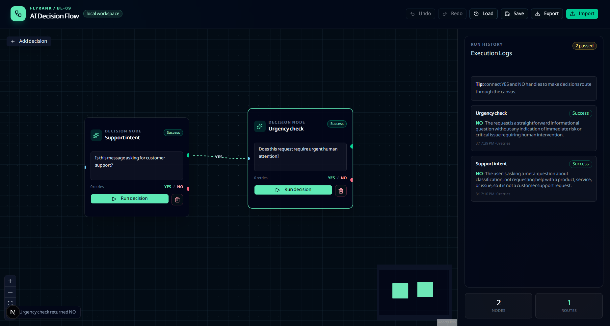

# AI Decision Flow

An interactive AI decision workflow built with Next.js, React Flow, Inngest, and a Groq/OpenAI-compatible model. Users edit decision nodes on the canvas, queue individual nodes for background execution, and watch the result and execution log return to the UI.

## Architecture

The React Flow canvas is the workflow editor and execution surface. Running a node sends `POST /api/workflow/run`, which creates an execution record and publishes a `workflow/execute-node` event to Inngest. The Inngest function runs the LLM decision, updates the execution store, and records either a `YES` or `NO` result. The browser polls `GET /api/workflow/status/:runId` and applies the result to the node and sidebar log in real time.

```text
React Flow canvas
       |
       v
Next.js /api/workflow/run --> Inngest event queue
				    |
				    v
			    LLM decision function
				    |
				    v
React Flow polling <-- /api/workflow/status/:runId
```

## LLM Resilience

- Zod validates every model response against the strict `{ decision: "YES" | "NO", reason }` schema.
- Invalid JSON or schema output gets exactly one repair request that includes the validation error.
- Model calls have an explicit 30-second timeout and retry only transient provider failures.
- The `LLM_ENABLED=false` kill switch returns a deterministic fallback without calling the provider.
- Structured cost and execution metrics include token counts, duration, and repair count.

## Phase 4 Polish

- Visual node execution states: Idle, Running, Success, and Error.
- Real-time execution logs in the sidebar.
- Local storage persistence for the workflow canvas.
- JSON workflow import and export.
- Animated branching edges labelled `YES` and `NO`.

## Setup and Run

From the repository root:

```bash
cd decision-flow
npm install
npm run dev            # Runs Next.js app on port 3002
npx inngest-cli dev -u http://localhost:3002/api/inngest  # Runs Inngest on port 8288
```

Open `http://localhost:3002` for the workflow UI and `http://localhost:8288` for the local Inngest dashboard. Configure the provider credentials and runtime flags in `decision-flow/.env`; keep that file untracked.

## Evidence

### Inngest Dashboard

The completed background runs and dynamic model results are shown in the Inngest dashboard:



### React Flow Canvas

The canvas screenshot shows successful node execution states, branching edges, and the sidebar execution logs:


